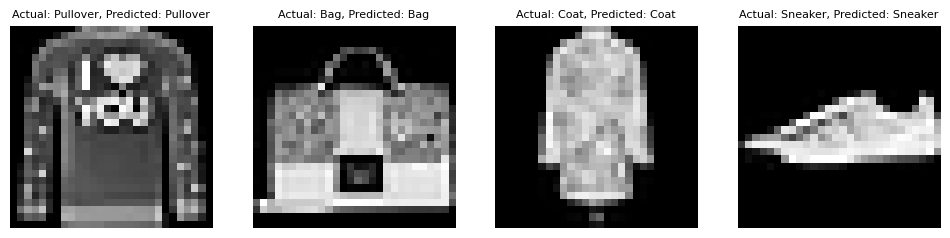

# Neural Networks From Scratch
This is a python package which implements a variety of tools for creating
neural networks from scratch, using `numpy` as the main computational
package. This includes the models, layers, activation functions, optimization
functions for training models, and so on. In addition, this package makes
heavy use of vectorization for performance and as such does not require the
use of a GPU for calculations.

Overall, this package is meant to be more educational than functional, allowing
for insight into how the components of a neural network function and how training
is performed.

### Installation
To install the package and set up the environment, run `source env.sh`, which will
automatically run the appropriate `conda` commands to set up the environment with
`nnfs` and activate it.

### Examples
Within [`examples`](examples), there are two Jupyter notebooks that focus on
different training sets. One focuses on the traditional MNIST database, while
the other uses a more complex variant, Fashion MNIST, which is depicted below.

